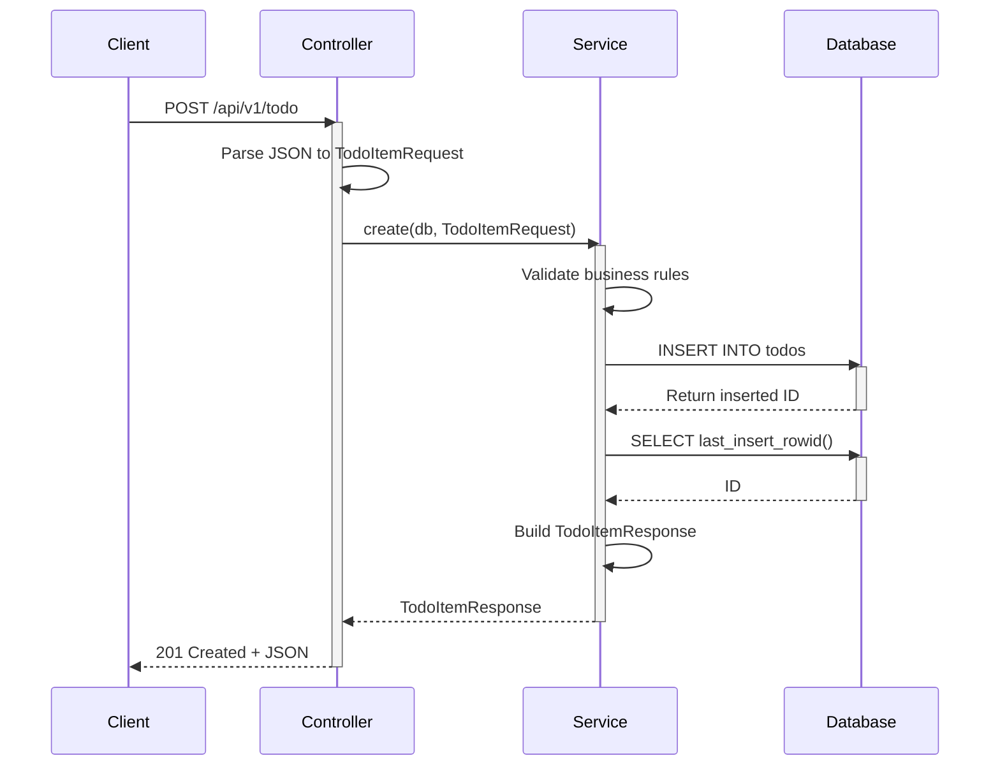
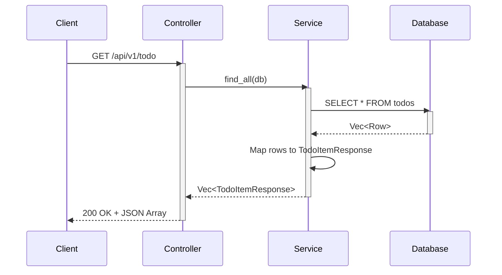
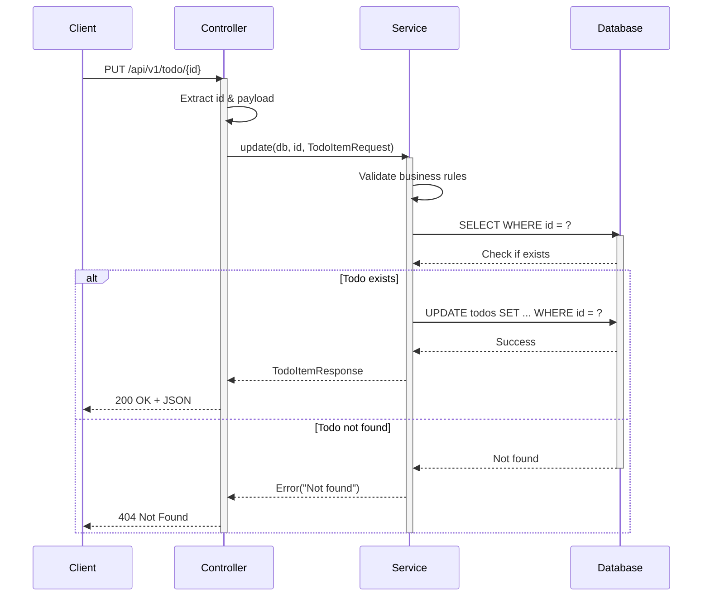
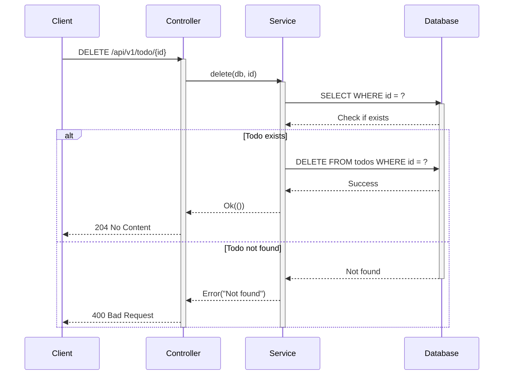

# TodoList SQLite - Rust REST API

A production-ready REST API built with Rust, featuring a clean architecture pattern with Controllers and Services layers, similar to modern backend frameworks.

## 🚀 Features

- **Clean Architecture**: Separation of concerns with Controller → Service layers
- **Dependency Injection**: Using traits (interfaces) for loose coupling
- **Async/Await**: Full async support with Tokio runtime
- **Type Safety**: Leveraging Rust's strong type system
- **RESTful API**: Complete CRUD operations
- **SQLite Database**: Lightweight embedded database
- **OpenAPI/Swagger**: Auto-generated interactive API documentation
- **Configuration Management**: External configuration file support
- **Hot Reload**: Development mode with auto-restart

## 📋 Table of Contents

- [Architecture](#architecture)
- [Tech Stack](#tech-stack)
- [Installation](#installation)
- [Usage](#usage)
- [API Endpoints](#api-endpoints)
- [OpenAPI & Swagger UI](#openapi--swagger-ui)
- [Project Structure](#project-structure)
- [Sequence Diagrams](#sequence-diagrams)
- [Development](#development)
- [Design Patterns Used](#design-patterns-used)
- [Best Practices](#best-practices)

## 🏗️ Architecture

This project follows a layered architecture pattern:

```
┌─────────────────┐
│   Controller    │  HTTP handling, routing
├─────────────────┤
│    Service      │  Business logic & data access
├─────────────────┤
│    Database     │  SQLite
└─────────────────┘
```

### Key Components

- **Controllers**: Handle HTTP requests and responses
- **Services**: Contain business logic and database operations
- **Models**: Request/Response DTOs
- **Types**: Shared types and application state

## 🛠️ Tech Stack

- **Framework**: [Axum](https://github.com/tokio-rs/axum) - Ergonomic web framework
- **Runtime**: [Tokio](https://tokio.rs/) - Async runtime
- **Database**: [SQLite](https://www.sqlite.org/) via `sqlite` crate
- **Serialization**: [Serde](https://serde.rs/) - JSON handling
- **Documentation**: [utoipa](https://github.com/juhaku/utoipa) - OpenAPI generation
- **API Testing**: [utoipa-swagger-ui](https://github.com/juhaku/utoipa) - Interactive UI
- **Configuration**: Custom config management

## 📦 Installation

### Prerequisites

- Rust 1.70 or higher
- Cargo

### Setup

```bash
# Clone the repository
git clone https://github.com/wlopezob/portfolio-rust.git
cd todolist-sqlite

# Build the project
cargo build

# Run the application
cargo run
```

## 🚀 Usage

The server will start on `http://127.0.0.1:8080` by default.

### Environment Configuration

Create or edit `src/properties/application.yaml`:

```yaml
app:
  prefix: /api/v1

server:
  host: 127.0.0.1
  port: 8080
```

## 📡 API Endpoints

| Method | Endpoint | Description |
|--------|----------|-------------|
| `POST` | `/api/v1/todo` | Create a new todo |
| `GET` | `/api/v1/todo` | Get all todos |
| `GET` | `/api/v1/todo/{id}` | Get todo by ID |
| `PUT` | `/api/v1/todo/{id}` | Update todo |
| `DELETE` | `/api/v1/todo/{id}` | Delete todo |

### Request Examples

**Create Todo**
```bash
curl -X POST http://localhost:8080/api/v1/todo \
  -H "Content-Type: application/json" \
  -d '{"title": "Learn Rust", "completed": false}'
```

**Get All Todos**
```bash
curl http://localhost:8080/api/v1/todo
```

**Update Todo**
```bash
curl -X PUT http://localhost:8080/api/v1/todo/1 \
  -H "Content-Type: application/json" \
  -d '{"title": "Learn Rust", "completed": true}'
```

**Delete Todo**
```bash
curl -X DELETE http://localhost:8080/api/v1/todo/1
```

## 📚 OpenAPI & Swagger UI

This project includes **automatic API documentation** using OpenAPI 3.0 and an interactive Swagger UI interface.

### Access Documentation

- **Swagger UI**: http://localhost:8080/api/swagger-ui
- **OpenAPI JSON**: http://localhost:8080/api/api-docs/openapi.json

### Features

✅ **Auto-generated documentation** from Rust code  
✅ **Interactive testing** directly in the browser  
✅ **Type-safe** - Documentation synchronized with code  
✅ **Zero runtime overhead** - Generated at compile time  

### Quick Start

1. Start the server: `cargo run`
2. Open http://localhost:8080/api/swagger-ui in your browser
3. Try out endpoints directly from the UI:
   - Click on any endpoint to expand
   - Click "Try it out"
   - Fill in parameters/request body
   - Click "Execute" to see the response

### Implementation

The OpenAPI integration uses:
- **`utoipa`** - Core OpenAPI generation
- **`utoipa-axum`** - Axum-specific helpers
- **`utoipa-swagger-ui`** - Embedded Swagger UI

For detailed implementation guide, see **[OPENAPI.md](OPENAPI.md)**

## 📁 Project Structure

```
todolist-sqlite/
├── src/
│   ├── main.rs              # Application entry point
│   ├── config/              # Configuration management
│   │   ├── mod.rs
│   │   └── settings.rs
│   ├── controller/          # HTTP request handlers
│   │   ├── mod.rs
│   │   └── todo_controller.rs
│   ├── service/             # Business logic & data access
│   │   ├── mod.rs
│   │   └── todo_service.rs
│   ├── model/               # DTOs
│   │   ├── mod.rs
│   │   ├── todo_item_request.rs
│   │   └── todo_item_response.rs
│   ├── routes/              # Route configuration
│   │   └── mod.rs
│   ├── types/               # Shared types
│   │   └── mod.rs
│   └── properties/          # Config files
│       └── application.yaml
├── data/
│   └── todo.db              # SQLite database
├── Cargo.toml
└── README.md
```

## 📊 Sequence Diagrams

### Create Todo Flow



### Get All Todos Flow



### Update Todo Flow



### Delete Todo Flow



## 🔧 Development

### Configuration

Edit `src/properties/application.yaml`:

```yaml
app:
  prefix: /api/v1

server:
  host: 127.0.0.1
  port: 8080
```

### Database Schema

```sql
CREATE TABLE IF NOT EXISTS todos (
    id INTEGER PRIMARY KEY AUTOINCREMENT,
    title TEXT NOT NULL,
    completed BOOLEAN NOT NULL DEFAULT 0
);
```

## 🎯 Design Patterns Used

- **Dependency Injection**: Via `AppState` and trait objects
- **Service Layer Pattern**: Business logic encapsulation
- **DTO Pattern**: Request/Response models separate from domain
- **Trait-based Polymorphism**: `TodoService` trait for testability
- **Result Pattern**: Error handling with `Result<T, E>`
- **Builder Pattern**: Axum's Router builder

## 🔐 Best Practices

✅ **Type Safety**: Strong typing throughout  
✅ **Error Handling**: Proper Result types and error propagation  
✅ **Separation of Concerns**: Layered architecture  
✅ **Async/Await**: Non-blocking I/O operations  
✅ **Configuration**: External configuration files  
✅ **Dependency Injection**: Loose coupling via traits  

## 📝 License

This project is open source and available under the MIT License.

## 🤝 Contributing

Contributions are welcome! Please feel free to submit a Pull Request.

## 📧 Contact

For questions or suggestions, please open an issue on GitHub.

---

**Built with ❤️ using Rust**