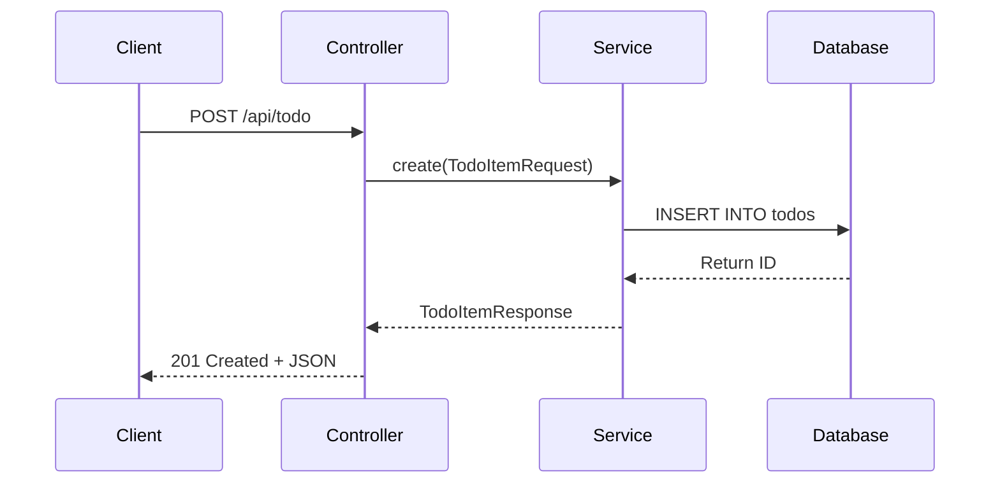
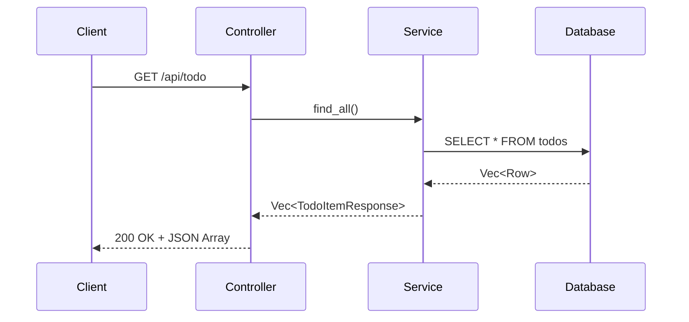

# TodoList SQLite - Rust REST API

A production-ready REST API built with Rust, featuring a clean architecture pattern with Controllers and Services layers, similar to modern backend frameworks.

## 🚀 Features

- **Clean Architecture**: Separation of concerns with Controller → Service layers
- **Dependency Injection**: Using traits (interfaces) for loose coupling
- **Async/Await**: Full async support with Tokio runtime
- **Type Safety**: Leveraging Rust's strong type system
- **RESTful API**: Complete CRUD operations
- **SQLite Database**: Lightweight embedded database
- **OpenAPI/Swagger**: Auto-generated interactive API documentation
- **Configuration Management**: External configuration file support
- **Hot Reload**: Development mode with auto-restart

## 📋 Table of Contents

- [Architecture](#️-architecture)
- [Tech Stack](#️-tech-stack)
- [Installation](#-installation)
- [Usage](#-usage)
- [API Endpoints](#-api-endpoints)
- [OpenAPI & Swagger UI](#-openapi--swagger-ui)
- [Error Handling with thiserror](#-error-handling-with-thiserror)
- [Configuration Manager](#️-configuration-manager)
- [Project Structure](#-project-structure)
- [Sequence Diagrams](#-sequence-diagrams)
- [Development](#-development)
- [Design Patterns Used](#-design-patterns-used)
- [Best Practices](#-best-practices)

## 🏗️ Architecture

This project follows a layered architecture pattern:

```
┌─────────────────┐
│   Controller    │  HTTP handling, routing
├─────────────────┤
│    Service      │  Business logic & data access
├─────────────────┤
│    Database     │  SQLite
└─────────────────┘
```

### Key Components

- **Controllers**: Handle HTTP requests and responses
- **Services**: Contain business logic and database operations
- **Models**: Request/Response DTOs
- **Types**: Shared types and application state

## 🛠️ Tech Stack

- **Framework**: [Axum](https://github.com/tokio-rs/axum) - Ergonomic web framework
- **Runtime**: [Tokio](https://tokio.rs/) - Async runtime
- **Database**: [SQLite](https://www.sqlite.org/) via `sqlite` crate
- **Serialization**: [Serde](https://serde.rs/) - JSON handling
- **Documentation**: [utoipa](https://github.com/juhaku/utoipa) - OpenAPI generation
- **API Testing**: [utoipa-swagger-ui](https://github.com/juhaku/utoipa) - Interactive UI
- **Configuration**: Custom config management

## 📦 Installation

### Prerequisites

- Rust 1.70 or higher
- Cargo

### Setup

```bash
# Clone the repository
git clone https://github.com/wlopezob/portfolio-rust.git
cd todolist-sqlite

# Build the project
cargo build

# Run the application
cargo run
```

## 🚀 Usage

The server will start on `http://127.0.0.1:8080` by default.

Access the API at: `http://localhost:8080/api/todo`

## 📡 API Endpoints

| Method | Endpoint | Description |
|--------|----------|-------------|
| `POST` | `/api/todo` | Create a new todo |
| `GET` | `/api/todo` | Get all todos |
| `GET` | `/api/todo/{id}` | Get todo by ID |
| `PUT` | `/api/todo/{id}` | Update todo |
| `DELETE` | `/api/todo/{id}` | Delete todo |

## 📚 OpenAPI & Swagger UI

This project includes **automatic API documentation** using OpenAPI 3.0 and Swagger UI.

### Access Documentation

- **Swagger UI**: http://localhost:8080/api/swagger-ui
- **OpenAPI JSON**: http://localhost:8080/api/api-docs/openapi.json

### Features

✅ **Auto-generated documentation** from Rust code  
✅ **Interactive API testing** in the browser  
✅ **Type-safe** - synchronized with code  
✅ **Zero runtime overhead**  

For detailed implementation guide, see **[OPENAPI.md](OPENAPI.md)**

## 🔧 Error Handling with thiserror

This project implements **robust error handling** using `thiserror` with automatic error conversions and type-safe propagation.

### Features

✅ **Automatic error conversion** with `From` trait  
✅ **Type-safe propagation** using `?` operator  
✅ **HTTP status code mapping**  
✅ **Consistent JSON responses**  

### Error Response Format

```json
{
  "code": "404 Not Found",
  "message": "Todo item with 5 not found"
}
```

For detailed implementation guide, see **[THISERROR.md](THISERROR.md)**

## ⚙️ Configuration Manager

Multi-environment configuration system with YAML files and automatic `.env` loading.

### Features

✅ **Profile-based** - Separate settings for dev/staging/production  
✅ **YAML configuration** - Easy to maintain  
✅ **Type-safe** - Rust structs  
✅ **Auto-loading** - Via `dotenvy`  

### Quick Start

```bash
# Setup
cp .env.example .env

# Run (uses dev profile by default)
cargo run

# Production
echo "PROFILE=prod" > .env
cargo run
```

For detailed implementation guide, see **[CONF-MANAGER.md](CONF-MANAGER.md)**

## 📁 Project Structure

```
todolist-sqlite/
├── src/
│   ├── main.rs              # Application entry point
│   ├── config/              # Configuration management
│   │   ├── mod.rs
│   │   └── settings.rs
│   ├── controller/          # HTTP request handlers
│   │   ├── mod.rs
│   │   └── todo_controller.rs
│   ├── service/             # Business logic & data access
│   │   ├── mod.rs
│   │   └── todo_service.rs
│   ├── model/               # DTOs
│   │   ├── mod.rs
│   │   ├── todo_item_request.rs
│   │   └── todo_item_response.rs
│   ├── routes/              # Route configuration
│   │   └── mod.rs
│   ├── types/               # Shared types
│   │   └── mod.rs
│   └── properties/          # Config files
│       └── application.yaml
├── data/
│   └── todo.db              # SQLite database
├── Cargo.toml
└── README.md
```

## 📊 Sequence Diagrams

### Create Todo Flow


```mermaid
sequenceDiagram
    participant Client
    participant Controller
    participant Service
    participant Database

    Client->>Controller: POST /api/todo
    Controller->>Service: create(TodoItemRequest)
    Service->>Database: INSERT INTO todos
    Database-->>Service: Return ID
    Service-->>Controller: TodoItemResponse
    Controller-->>Client: 201 Created + JSON
```

### Get All Todos Flow


```mermaid
sequenceDiagram
    participant Client
    participant Controller
    participant Service
    participant Database

    Client->>Controller: GET /api/todo
    Controller->>Service: find_all()
    Service->>Database: SELECT * FROM todos
    Database-->>Service: Vec<Row>
    Service-->>Controller: Vec<TodoItemResponse>
    Controller-->>Client: 200 OK + JSON Array
```

## 🔧 Development

### Database Schema

```sql
CREATE TABLE IF NOT EXISTS todos (
    id INTEGER PRIMARY KEY AUTOINCREMENT,
    title TEXT NOT NULL,
    completed BOOLEAN NOT NULL DEFAULT 0
);
```

## 🎯 Design Patterns Used

- **Dependency Injection**: Via `AppState` and trait objects
- **Service Layer Pattern**: Business logic encapsulation
- **DTO Pattern**: Request/Response models separate from domain
- **Trait-based Polymorphism**: `TodoService` trait for testability
- **Result Pattern**: Error handling with `Result<T, E>`
- **Builder Pattern**: Axum's Router builder

## 🔐 Best Practices

✅ **Type Safety**: Strong typing throughout  
✅ **Error Handling**: Proper Result types and error propagation  
✅ **Separation of Concerns**: Layered architecture  
✅ **Async/Await**: Non-blocking I/O operations  
✅ **Configuration**: External configuration files  
✅ **Dependency Injection**: Loose coupling via traits  

## 📝 License

This project is open source and available under the MIT License.

## 🤝 Contributing

Contributions are welcome! Please feel free to submit a Pull Request.

## 📧 Contact

For questions or suggestions, please open an issue on GitHub.

---

**Built with ❤️ using Rust**